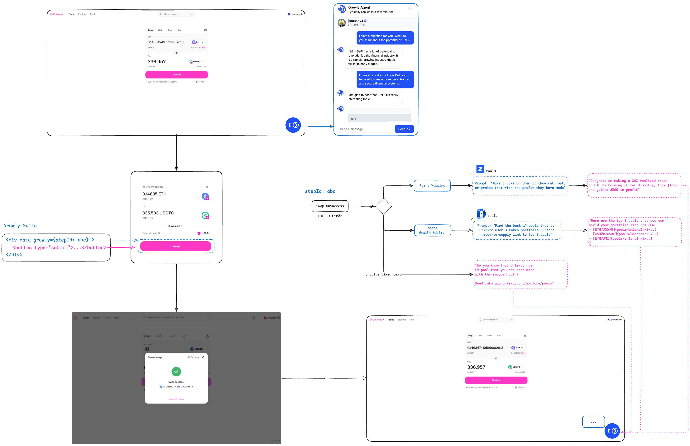
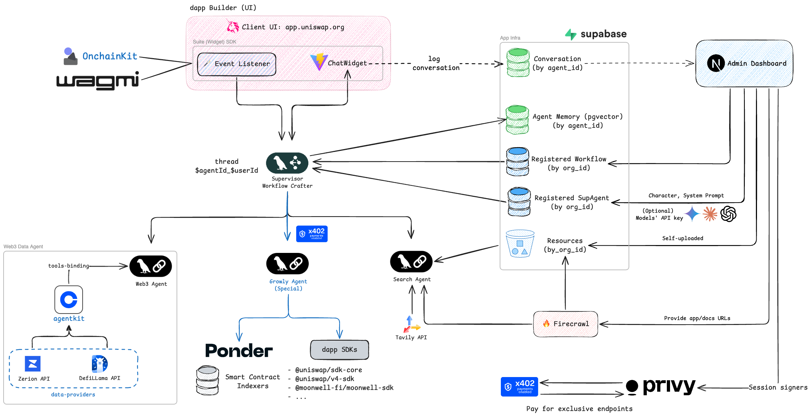

<div align="center">
  <p>
    <a href="https://getgrowly.app">
      
    </a>
  </p>
  <p style="font-size: 1.2em; max-width: 600px; margin: 0 auto 20px;">
    Empower DeFi Adoption with AI-powered Engine
  </p>
</div>

> [!NOTE]  
> **Special Note**: This product is freshly built in the Base Batch APAC duration (starting from Apr 28). We reuse the boilerplate code from our exisintg project. Please check this [clean up codebase commit](https://github.com/growly-foundation/suite/commit/86ced585cd5082c575ec97fbe7e884a1779d4d27) that fully demonstrates there is no prior code has been taken into account (except the CI/CD setup that we want to reuse on existing repo).

## 🚀 Overview

Suite is an AI-powered engine designed to streamline DeFi adoption by integrating cutting-edge AI agents into blockchain applications. Our solution bridges the gap between complex DeFi protocols and everyday users through an intuitive AI chat widget that can be easily embedded into any dApp.

Built on Base, Suite leverages the power of AI to help users navigate on-chain actions, understand DeFi opportunities, and make informed decisions without requiring deep technical knowledge of blockchain.

| Resource Name | Link  |  
|---|---|
| Website  | https://getgrowly.app  |   
| Suite Dashboard  | https://suite.getgrowly.app  | 
| Suite Playground  | https://playground.getgrowly.app  | 
| Suite Uniswap Demo  | https://uniswap.getgrowly.app  | 
| Original Idea Pitch  | [View the original idea](https://github.com/user-attachments/files/19884167/growly-widget-deck.2.pdf)  |   
|  Pitch Deck for Base Batches | [View our pitch deck](https://www.figma.com/deck/uF0kJ0gn0ViJgPUUrdq1yn/-Growly-Suite--Pitch-Deck)  |    

## 🏗️ Project Architecture

<div align="center">
  
</div>

Our project consists of several interconnected packages:

- **@growly/core**: Core utilities and shared functionality
- **@growly/ui**: Reusable UI components library
- **@growly/suite**: The embeddable chat widget to be installed on dApp websites
- **@growly/server**: Backend infrastructure that powers the AI agents and blockchain interactions
- **@growly/website**: Landing page showcasing Suite's capabilities
- **@growly/dashboard**: Admin dashboard for monitoring and managing Suite integrations

**_Note: Genosis Safe integration will be in future development for batch onchain transactions!_**

## ✨ Key Features

- **AI-powered Chat Widget**: Easily embeddable on any dApp or DeFi website
- **Natural Language DeFi Interactions**: Execute complex on-chain actions through simple conversations
- **Cross-Chain Support**: Operate across Base and other EVM-compatible networks
- **Low Integration Barrier**: Quick installation with minimal coding required
- **Contextual Help**: AI agents understand the context of the dApp they're embedded in
- **Smart Contract Insights**: Analyze and explain contract functionality in plain language
- **Transaction Guidance**: Step-by-step assistance with executing and monitoring transactions

## 📗 User Guides

### Admin Dashboard

- Go to [suite.getgrowly.app](https://suite.getgrowly.app) to create the Organization, Agents, Workflows,...
- Each admin email will generate a Privy embedded wallet that can be use for x402 payment (required [Privy Session Signer](https://docs.privy.io/wallets/using-wallets/session-signers))
- Upload additional resources (Website, Document sites, GitHub, Smart Contract,...)
- Define the `Workflows` and `Steps` with **natural language prompts**, such as:
  - Introduce about Uniswap when user log into page
  - Tell user a fact about his/her portfolio when they opened the AccountDrawer
  - ...

### Protocol's Production Interface

- Install `@growly/suite` to your interface code (for example: [Uniswap/interface](https://github.com/Uniswap/interface)) and follow the guide
- Customers of DeFi protocols (such as Uniswap, Moonwell, Morpho,...) can now access to smart AI Agent that already know about their past on-chain activities, DeFi know-how, and portfolio
- Using the `stepId`, the widget can trigger interactive engagement with customers. For example

<div align="center">
  
</div>

## 🛠️ Technology Stack

- **Frontend**: React, TypeScript, Tailwind CSS
- **Backend**: Node.js, NestJS
- **AI**: LLM integration with Langchain + Agent kit, specialized on-chain knowledge
- **Blockchain**: Base L2, EVM compatibility
- **Web3 Interfaces**: Onchainkit, Wagmi, Viem
- **Onchain Payment**: Exclusive API via [x402](https://www.x402.org/)

## Agentic Solution Design

<div align="center">
  
</div>

> Smart agent requires curated and understandable onchain data to make accurate actions!

Leverage Langgraph Multi-agent Supervisor architecture, wrapped inside a NestJS server API, there will be 3 specialized agents:

- **Web3 Data Agent**: Retrieve web3-related information, including user portfolio and onchain activities -> Exclusive engine to know your customer
- **Search Agent**: Mixed between Firecrawl and Tavily to retrieve accurate search information, as well as curated given documentations by organizations from the dashboard
- **Growly Agent**: Native web3 agent that are programmable to use web3 SDK to retrieve/access smart contract data, or query indexed data via Ponder **_(implementing)_**.

For the demonstration purpose of onchain payment via x402, all the route that require Growly agent to take action will charge admin a slight amount of USDC. See on [Base sepolia explorer](https://sepolia.basescan.org/address/0x4D988692Eee37d15D9c08a6f2A0426164BfD896e#tokentxns)

## 🚀 Getting Started

### Prerequisites

- Node.js (v18+)
- PNPM (v10+)

### Installation

```bash
# Clone the repository
git clone https://github.com/yourusername/suite.git
cd suite

# Install dependencies
pnpm install

# Build all packages
pnpm build
```

### Running the Development Environment

```bash
# Start all services in development mode
pnpm dev

# Or start specific packages
pnpm dev:website  # For landing page
pnpm dev:suite    # For widget development
```

## 📦 Package Structure

- [**@growly/core**](https://www.npmjs.com/package/@getgrowly/core): Core utilities shared across the monorepo
- [**@growly/ui**](https://www.npmjs.com/package/@getgrowly/ui): UI component library built with React and Tailwind
- [**@growly/suite**](https://www.npmjs.com/package/@getgrowly/suite): The main widget package that dApp developers integrate
- **@growly/server**: Backend service for AI processing and blockchain interactions
- **@growly/website**: Marketing website and documentation
- **@growly/dashboard**: Admin interface for managing integrations

## 📚 Documentation

For developers looking to integrate Suite into their dApps, please check our [integration guide](#).

## 🌐 Demo

[Live Demo](https://getgrowly.app) - Experience the Suite widget in action!

## 🏆 Base Batch APAC Submission

This project is a submission to the [Base Batch APAC](https://base-batch-apac.devfolio.co/overview) buildathon, targeting both the AI and DeFi tracks:

- **AI Track**: With the motto **"Bring LLM to every DeFi protocols, instead of one centralized UI"**, we help creating a dedicated toolkit for dapp/protocol builder to extend there AI agent capability with one click. This is not only a chatbot, but can do more DeFi native use cases, given user's portfolio that can be retrieved onchain by our service, and protocol's domain that managed via Suite dashboard.
- **DeFi Track**: Suite already provide a AI-agent widget that pre-trained with DeFi knowledge (Superchain token list, DeFiLlama and Zerion API). The agent can provide from:
  - High-level rebalance strategy with reasoning based on risk-profile (analyzed from current portfolio); suggest yield as liquidity provider, to
  - Specific DeFi protocol actions' touchpoints with intent suggestion (prefill swap and createPosition) links on Uniswap.
  - Under the background, the agent has accessed to Uniswap v4 SDK and familiarized with tickSpacing to provide the user near real-time APR of a pool

## 📄 License

This project is licensed under the MIT License - see the [LICENSE.md](LICENSE.md) file for details.

## 🙏 Acknowledgements

- Base for their powerful L2
- Coinbase Developer Platform for essential tools
- All contributors and supporters
