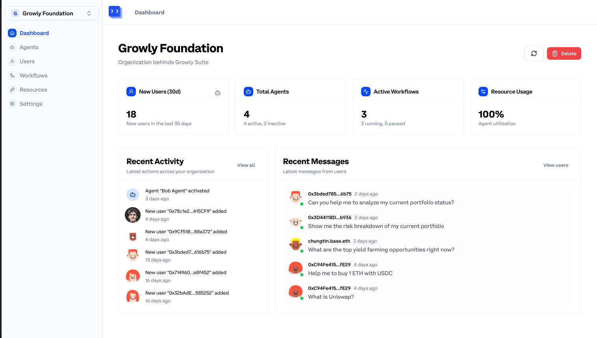
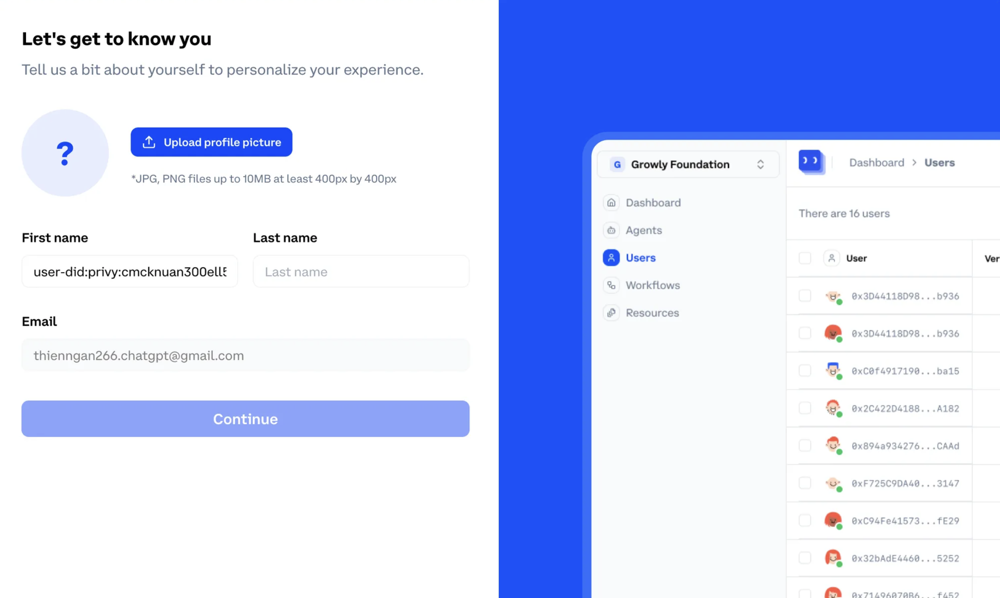
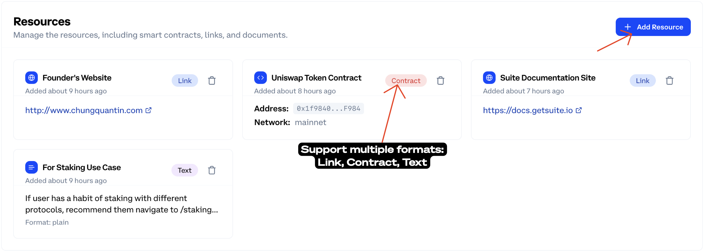
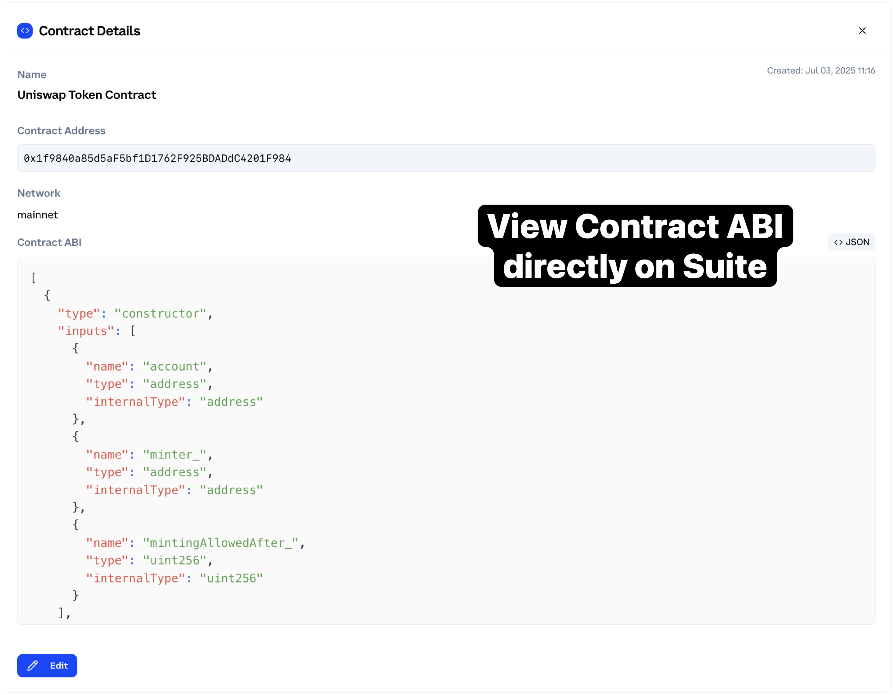
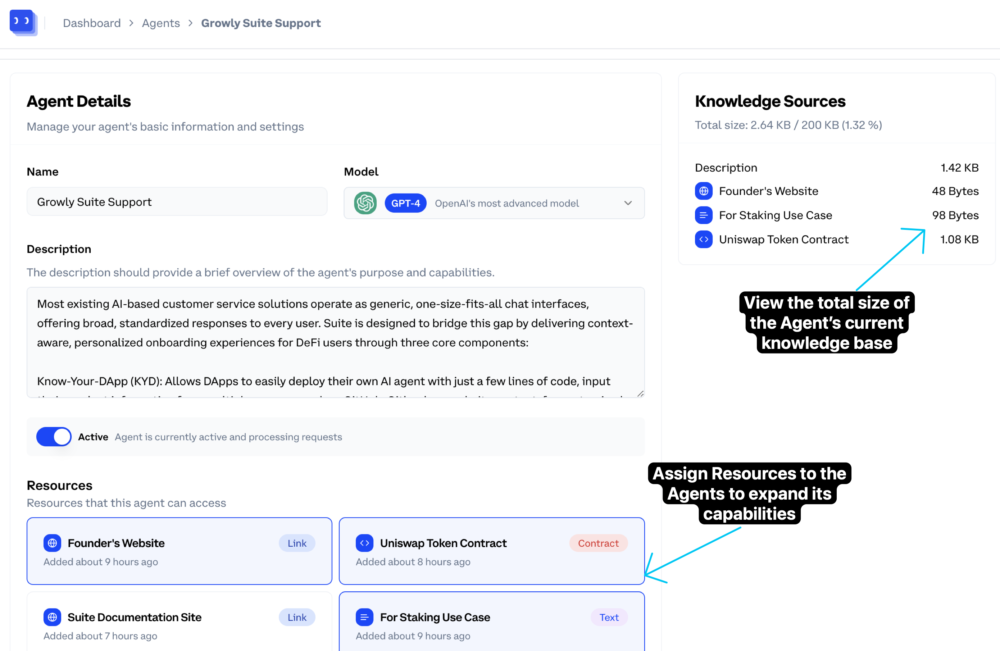
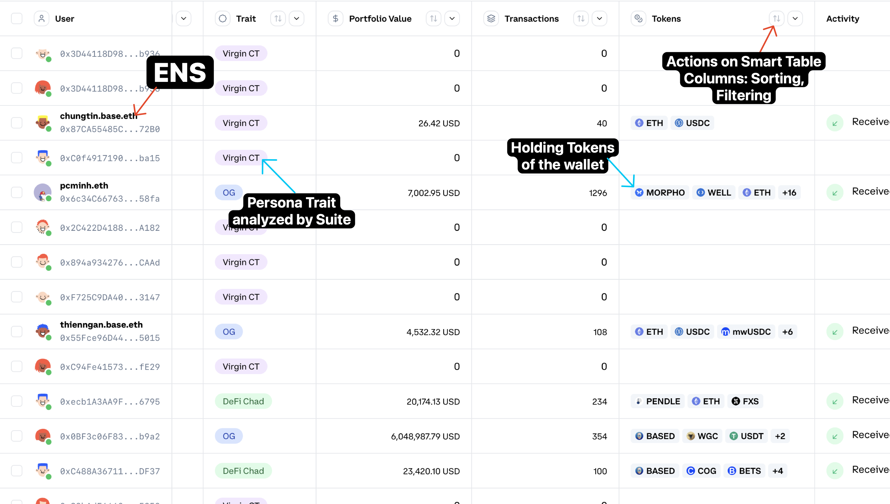
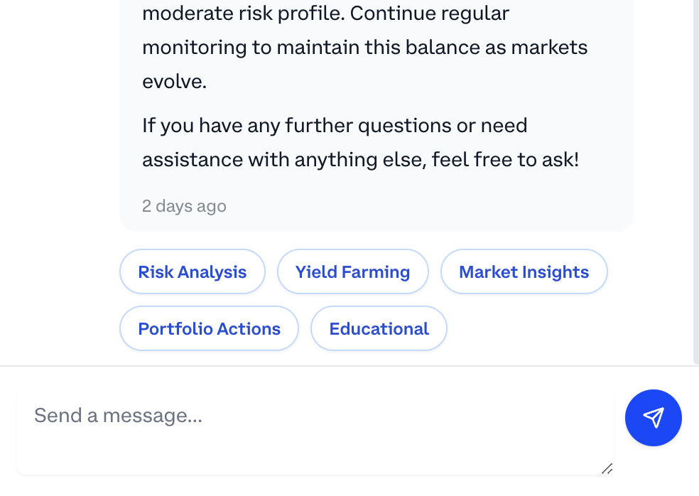

# Suite July 2025 Update

More resources for your agents, smarter insights for your users, and faster access to critical data.

**Period:** June 19 – July 3, 2025

## Development Focus

The Suite team continues to prioritize our core mission: making DeFi more accessible through intuitive AI agents. This sprint, we've focused on enhancing the depth and customizability of our agent ecosystem, empowering our partners with better resource management tools and deeper insights into user interactions.

Our engineering efforts are centered on three pillars:

1. **Knowledge Enrichment** - Enabling agents to access more diverse, specialized resources
2. **User Experience Refinement** - Creating smoother interactions between users and agents
3. **Admin Tooling Enhancement** - Giving organizations powerful visibility into conversations and usage patterns

Suite is an AI-powered engine designed to streamline DeFi adoption by integrating cutting-edge AI agents into blockchain applications. Built on Base, Suite helps users navigate on-chain actions, understand DeFi opportunities, and make informed decisions—without needing deep technical knowledge of blockchain.

Below is an overview of recent improvements, new features, and what's coming next.

## 💙 Recent Releases

### New Onboarding Flow

We have launched a redesigned onboarding experience to make it faster and more intuitive for new businesses to get started:

- **Create a new profile**
- **Create a new organization**
- Guided steps to integrate Suite with your dApp

For full details, see the [Suite Integration Guide](https://sphenoid-ethernet-3e7.notion.site/suite-integration-guide).

### Resource Management for the Agent

Agents can now be equipped with custom resources via our comprehensive resource management system:

- **Multi-format Support**: Upload text content, website links, documents, and smart contracts to expand the Agent's knowledge base

- **Contract Analysis**: View and explore the ABI of uploaded smart contracts directly within Suite with syntax highlighting

- **Resource Assignment**: Easily assign resources to specific agents through an intuitive drag-and-drop interface
- **Size Optimization**: Visual representation of resource usage with automatic byte counting to ensure optimal performance
- **Context Management**: Resources are intelligently incorporated into agent prompts to maintain relevant context

This system ensures your agents always have the most current information about your protocols, documentation, and smart contract interfaces, enabling them to provide precise and tailored guidance to your users.

### Smart Tables for User Persona Management

Our new **Smart Tables** feature revolutionizes how organizations understand and segment their users:

- **Dynamic Filtering**: Create complex filters based on wallet activity, interaction history, and user attributes
- **Custom Views**: Save and share different table configurations across your team
- **Data Visualization**: Quickly identify patterns and trends within your user base
- **Export Capabilities**: Extract insights for external analysis or reporting
- **Persona Grouping**: Cluster similar users to develop targeted engagement strategies

Smart Tables help you move beyond one-size-fits-all approaches to create personalized, context-aware AI interactions that resonate with different user segments.

### Agent Intent Suggestions and Recommendations

We've enhanced our agent intelligence system to better anticipate and guide user needs:

- **Intent Detection**: Agents now automatically identify the underlying purpose behind user queries
- **Guided Options**: Present users with relevant next steps based on their current context and history
- **Action Recommendations**: Suggest specific on-chain actions that align with user goals
- **Educational Prompts**: Offer explanatory content when users encounter unfamiliar concepts
- **Multi-path Support**: Present alternative approaches when multiple solutions exist

These improvements make interactions more intuitive and efficient, significantly reducing the friction users experience when navigating complex DeFi operations.

### Conversation Management Area

We've launched a comprehensive conversation monitoring system that gives organizations unprecedented visibility:

- **Conversation Timeline**: View the complete history of interactions between users and agents
- **Advanced Search**: Find specific conversations using filters for date, user, topic, or content
- **Sentiment Analysis**: Identify positive and negative interactions at a glance
- **Problem Detection**: Flag conversations where users experienced difficulties
- **Performance Metrics**: Track resolution rates and user satisfaction over time
- **Intervention Tools**: Jump into conversations when human expertise is needed

This system helps organizations identify patterns, refine their agent's responses, and provide timely support when automated systems need human backup.

### Dashboard Performance Optimization

We've completely revamped our dashboard backend to deliver a lightning-fast experience:

- **Query Optimization**: Reduced data loading times by over 90% through advanced caching and query restructuring
- **Pagination Implementation**: Added smart pagination to handle large datasets without performance degradation
- **Lazy Loading**: Implemented progressive loading of UI components to improve initial page rendering
- **State Management**: Refactored our state handling to prevent redundant API calls
- **Real-time Updates**: Added WebSocket support for live data updates without full page refreshes

These improvements ensure administrators can access critical insights and performance metrics instantly, even as your user base and data volume grow.

## 👀 Upcoming Features

We're excited to share our roadmap for the coming weeks. Our engineering team is focused on delivering these high-impact features:

### August 2025 Release

- **CSV User Import**  
  Import users from CSV files with wallet addresses and metadata to quickly build comprehensive user profiles. This will include automatic enrichment with on-chain data to create robust persona models from day one.

- **Smart Contract Indexing**  
  Our advanced indexing system will provide unprecedented visibility into how users interact with your smart contracts:
  - Real-time tracking of user interactions by function and contract
  - Historical transaction analysis with volume and frequency metrics
  - Anomaly detection for unusual contract behavior or usage patterns
  - Integration with agent knowledge base for contextual user assistance

### September 2025 Release

- **Guild.xyz Integration**  
  Connect your community management directly to Suite with our Guild.xyz integration:

  - Automatic user categorization based on Guild roles and memberships
  - Role-based access control for different agent capabilities
  - Community-specific agent knowledge and behavior customization
  - Cross-platform analytics between Guild engagement and on-chain activity

- **Enhanced Smart Tables**  
  Taking data analysis to the next level with:

  - Custom aggregation functions for complex metrics
  - Conditional formatting based on user attributes or behaviors
  - Shareable saved views for team collaboration
  - Scheduled reports and automated insights
  - Direct integration with popular analytics platforms

- **User Growth Charts**  
  Visualize your product adoption journey with:
  - Cohort analysis by acquisition channel and time period
  - Retention metrics and engagement patterns
  - Feature adoption tracking across your dApp ecosystem
  - Predictive growth modeling based on historical patterns
  - Customizable KPI tracking dashboards

## 📢 Big Announcement Coming Soon!

We're putting the finishing touches on a major partnership that will significantly expand Suite's capabilities and reach. Stay tuned for our announcement in mid-August – this collaboration will open exciting new opportunities for all Suite partners!

---

If you have questions, feedback, or would like to share ideas, please reach out to the Suite team. We look forward to helping you build the next generation of intuitive DeFi experiences.
